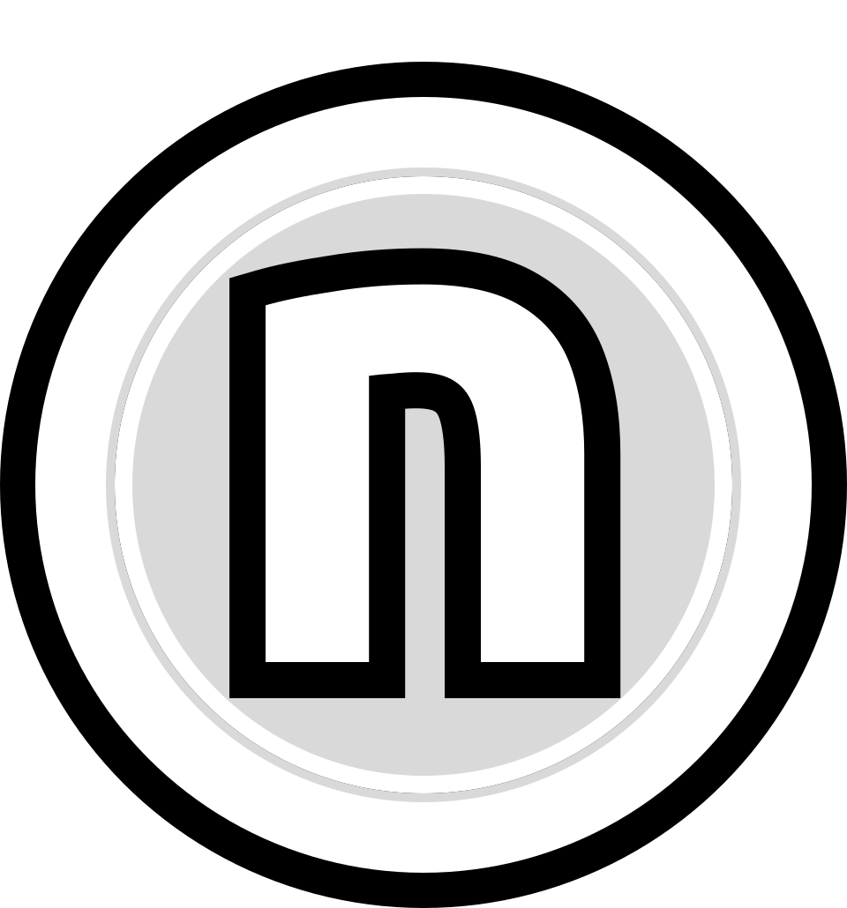

# The n-suite

A family of small, single-purpose apps for cataloguing, playing, sampling, and
publishing a personal music library — with **Nostr** as the shared publishing
and social layer. Built by **xjmzx** (`github.com/xjmzx/*`).

This is the **canonical hub document**. It holds the material shared across all
apps: the roster, the architecture conventions, the Nostr wire contract, the
design language, and the roadmap. Each app also ships its own
`<app>-introduction.md` covering its specifics and linking back here.

---

## The apps at a glance

| App | Role | Stack | Nostr role |
|-----|------|-------|-----------|
| **ndisc** | Discography catalogue + **publisher (the hub)** | Tauri 2 · React · SQLite | Publishes releases, labels, feed notes, reactions |
| **nplay** | Music + video player | Tauri 2 · React · SQLite · rodio | Reads the feed channel (Current view) |
| **ntree** | FLAC quality scanner + sampler + library mirror | Tauri 2 · React | Publishes NIP-94 clips + reactions; reads feed |
| **nsmpl** | Sample tool (two-track) + publisher | Tauri 2 · React | Publishes NIP-94 samples + reactions; reads feed |
| **nview** | Mobile viewer (read + react) | Capacitor · React | Reads releases/labels/feed; reacts via NIP-46 |
| **nping** | Nostr relay connectivity tester | Tauri 2 · React | No keys — tests relays |

`ndisc` is the authoritative publisher; everything else reads from and/or reacts
to the data it emits.

---

## Web consumption & sites

The publishing loop closes on the **web**, in a set of Nostr-based sites
developed on a separate **macOS device** and mirrored to the **`adjmx`** and
**`macos-node`** GitHub users. These are outside the `n` (Tauri/Capacitor) apps
but are first-class **consumers** of the same Nostr data — and they'll grow
alongside the project as its public face.

- **fizx.uk / upleb.uk** — the two Nostr-based personal sites. They *are* the two
  themes the whole suite's palette mirrors: **fizx** (default) and **upleb**
  (orange). Expected to expand with the projects.
- **glmps.fizx.uk / glmps.upleb.uk** — `glmps`, the **web-consumption
  demonstration reader**, served under each theme's domain. It renders the
  releases `ndisc` publishes against the shared contract — the canonical proof
  that a published release reads back correctly — and holds the **reader-side
  spec** `ndisc` publishes against.

---

## Shared architecture conventions

- **Desktop = Tauri 2** (React + Vite + TypeScript front end, Rust backend over
  IPC). **Mobile = Capacitor** (`nview` only).
- **SQLite** (`rusqlite`, bundled) where a local library index is needed
  (`ndisc`, `nplay`). Sampling/scanning apps (`ntree`, `nsmpl`) work against the
  filesystem live and don't keep a DB.
- **Native audio via `rodio`** in `nplay` — WebKit2GTK on the target Linux stack
  can't play media from any app URL scheme, so playback lives in Rust, not the
  webview. (Web Audio is also muted on this stack; short clips elsewhere use an
  `HTMLMediaElement`.)
- **Signing key** in the OS keyring for local-signer apps (`ndisc`, `ntree`,
  `nsmpl`); **NIP-46 remote bunker** for `nview`; none for `nplay`/`nping`.
- **Dev/install isolation** via `cfg(debug_assertions)` — debug builds use
  `*-dev` DB/config filenames and a distinct keyring service, so `make dev`
  never touches installed state.
- **Build**: `make dev` / `make install` for the Tauri apps (release path is
  `tauri build`, which runs Vite — never `cargo build --release`, which skips
  it). `nview` uses the Capacitor/Gradle toolchain. App icons derive from Figma
  masters.

---

## The Nostr wire contract (canonical)

The shared data spine. `ndisc` publishes it; the others read and/or react.

| Kind | Name | What it is | Publisher(s) | Reader(s) |
|------|------|-----------|--------------|-----------|
| **31237** | `release.v2` | A release (parameterized-replaceable; `d`-tag identity; genre / `tracks` / `discs` / `video` tags) | ndisc | nview, glmps, feed refs |
| **31238** | `labels.v1` | Record-label registry / metadata | ndisc | nview, glmps |
| **31239** | `feed.v1` | Feed-note channel (frozen contract; optional release `a`-ref) | owner (ndisc) | nplay (Current), nview, ntree, nsmpl |
| **30000** | NIP-51 list | Contributor registry (`d=glmps:contributors`) | ndisc | all |
| **4550** | NIP-72 | Per-note sign-off / approval | ndisc | — |
| **7** | NIP-25 | Reactions / ratings (shared `lib/rating.ts`, uniform aggregation) | ndisc, ntree, nsmpl, nview | all |
| **1063** | NIP-94 | File metadata for clips / samples, referencing a release | ntree (clips), nsmpl (samples) | — |

**Contract governance.** Two frozen, SHA-pinned contracts — `release.v2` and
`feed.v1` — live in [`schema/`](schema/). A contract change is a **coordinated
wave**: the publisher bumps the SHA and every consumer re-vendors it in the same
release. Two version axes apply everywhere — each app's own semver *and* the
shared `contract.vN` SHA (see `schema/README.md`).

**Relay notes.** `ndisc`'s relay set must be a **superset** of the website's
read set. Primal doesn't enforce `kind:5` deletions, so deletes are filtered
client-side.

**Signing paths.** Local `nsec` in the OS keyring → `ndisc`, `ntree`, `nsmpl`.
Remote NIP-46 bunker → `nview`. No keys (read-only / connectivity only) →
`nplay`, `nping`.

---

## Shared design language

### Brand marks (2026-07-14)

Masters live in `~/ProtonDrive/Figma-Icons`. Three tiers, and they are not
interchangeable:

| asset | what it is | where it may be used |
|---|---|---|
| `n.circle` | the **suite mark** — bold `n` in a ring, monochrome | docs, READMEs, org avatar. No theme risk. |
| `n.disc` · `n.play` · `n.smpl` · `n.tree` | per-app **horizontal lockups** (mark + wordmark, dot motif in each mark) | **docs only, for now.** Vendored per repo as `docs/<app>-lockup.svg`. |
| `<app>.svg` / `<app>-sq.svg` | **launcher icons** — the app-icon masters | `icon.svg` in each repo → scalable launcher + Tauri raster set |

**The lockups are not yet cleared for in-app use, and there is a specific reason.**
They are hardcoded mauve (`#AA43FF`), and **the upleb theme repaints `--c-mauve`
orange** — the exact collision that forced ndisc's publish state onto a dedicated
theme-neutral `--c-nostr`. A mauve lockup in a header would clash the moment the
theme is switched. Adopting them in-app means giving them a theme-neutral
treatment first.

**Design pointer (not built):** the lockups are the intended direction for each
app's **header title**, which today is plain text. Resolve the theme question
before acting on it.

### Parked for the lab

Three open design questions, all deliberately not guessed at:

1. **Theme-neutral lockups.** The per-app lockups are hardcoded mauve
   (`#AA43FF`); the upleb theme repaints `--c-mauve` orange. Needed before they
   can head an app's header. *What do they look like in orange?*
2. **The stack strip.** See below. If wanted, it must be a component built from
   real vector logos, with each app declaring its own stack — not one baked
   image.
3. **nview's Android adaptive icon.** Its three `@capacitor/assets` sources are
   the same flat artwork, so the *foreground* is full-bleed square art — and
   Android masks the foreground to ~66%, clipping the wordmark at both ends and
   cropping the dark base away entirely. Long-standing, not introduced by the
   2026-07-14 refresh. The fix is to split the layers (background = the flat
   base; foreground = the mark inside the safe zone), which is a decision about
   *how the mark reads when it cannot span the full width* — a design call, not
   a regeneration.

**Rejected: `n.stack`.** A strip of tech-stack logos intended for the footer
(which currently reads `stack: Tauri 2 + React + TS + Tailwind + SQLite` as
text). Sent back: it is a *fake* SVG — six base64 rasters, zero vector paths,
1.75 MB — and a single baked strip would **misstate two apps**, since nsmpl and
ntree have no SQLite and their footers correctly say so. If the strip is wanted,
it should be a shared component built from real vector logos (~1 KB each), with
each app declaring its own stack.

- **Palette** — the *fizx* dark scheme, driven by CSS variables (`--c-*` in each
  app's `index.css`) and exposed as Tailwind tokens in `tailwind.config.ts`. Two
  themes: **fizx.uk** (default) and **upleb.uk** (orange swap). **Reference the
  tokens, never hardcode hexes.** Semantic roles: `bg` / `panel` / `surface` /
  `surfaceHover`, `fg` / `muted`, `accent`, `digital`, `mauve`, `ok` / `warn` /
  `alert` / `auburn`, and `medium` (leaf-green, the physical/digital mark).
- **Typography** — Helvetica for UI; **monospace** for numbers, paths, IDs and
  hashes.
- **Form** — squared 90° corners; filled boxes over outlines.
- **Collapse-flanks layout** — a `Section` header click collapses a column to a
  2.5 rem `CollapsedStrip` sliver and hands its width to the neighbours via a
  grid template. Shared across `ndisc` / `ntree` / `nsmpl` / `nplay`.
- **Leaf / foliage vocabulary** — *leaf-dots* show present-vs-expected
  completeness (solid = present, faint = missing; threshold ~25%); *count
  badges* show track / disc counts.
- **Source-platform indicators** — `lib/source.ts` detects and colours
  bandcamp / soundcloud / mixcloud / wavlake / tidal; kept byte-identical in
  `ndisc` / `nview` / `glmps`.
- **Genre palette** — 38 active slugs with fixed hue assignments, shared between
  `ndisc` and `glmps` (the `g.*` Tailwind tokens; all slugs are pure peers).

---

## Direction / roadmap

**Near-term — tighten suite integration**
- Bring `ndisc`'s tree-dots + track/disc-count styling into `nplay`.
- Surface **"published to Nostr" status** for a release across the apps
  (starting from `ndisc`, which already tracks it).
- Have `ntree` / `nsmpl` clips & samples **reference the releases** they derive
  from (provenance links).

**Mid / long-term**
- Media edits — destructive *and* non-destructive.
- **BPM analysis** improvements (especially for `nplay`) — potentially emitted
  as its own `nevent` when a value is worth sharing.

**Ultimate aim**
- Samples as first-class objects for **collaboration** → track construction →
  release construction → publish / share / comment, all over Nostr.

**Homes & devices.** Schema + contracts live in `ndisc/schema`; the reader spec
lives in `glmps`. The `n` apps are developed here (Linux) under
`github.com/xjmzx/*`; the web sites (`fizx.uk` / `upleb.uk` and the `glmps.*`
readers) are developed on a **macOS device** and mirrored to the **`adjmx`** and
**`macos-node`** GitHub users. `nview` (mobile) builds on its own device. The
suite is being formalised as coordinated repos across all three.

---

*Per-app detail: see each repo's `<app>-introduction.md`.*
